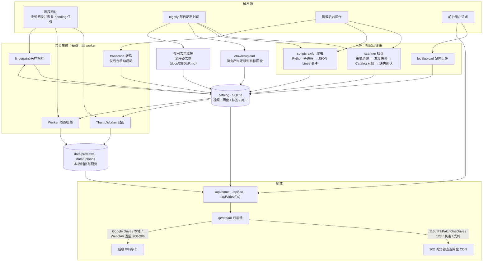
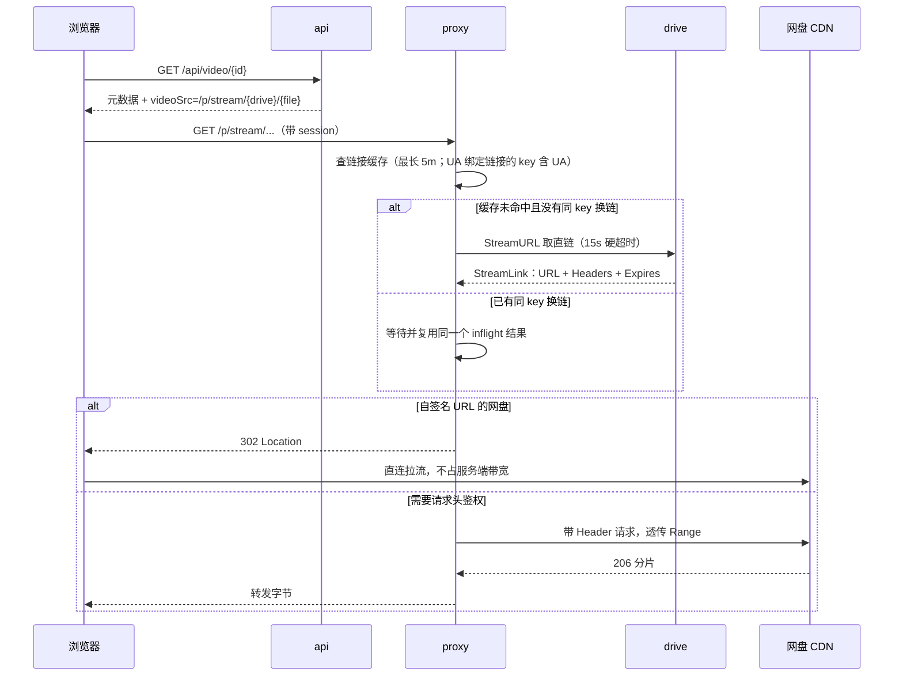
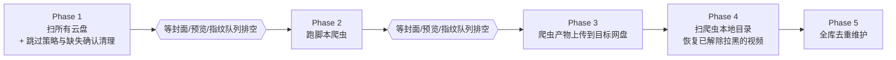

## 快速开始

依赖：**Go 1.23+**、**ffmpeg / ffprobe**（用于封面、预览视频、媒体探测/转码和内容级去重，必装；路径可在配置里改）。`sampled_sha256` 指纹由 Go 直接读取 Range 字节计算，不依赖 ffmpeg。SQLite 用纯 Go 驱动（modernc），无需系统库；依赖已 vendored，可离线构建。跑爬虫需要 `python3`。

```bash
cd backend
go run ./cmd/server        # 首次启动自动从 config.example.yaml 生成 config.yaml，监听 127.0.0.1:9192
go test ./...              # 单元测试；缺 ffmpeg / python3 时相关测试自动跳过
go build -o server ./cmd/server
```

前端开发在仓库根目录 `npm run dev`，vite 会把 `/api`、`/p`、`/admin/api`、`/peer` 代理到 9192。所有配置项及注释见 [config.example.yaml](config.example.yaml)，正文只在涉及行为时提及个别配置。

## 目录

仓库根目录是前端（Vite + React），`backend/` 是本文档描述的 Go 服务：

```
91/
  src/                      前端源码：admin/ 管理后台、pages/、components/、lib/、styles/
  tests/                    前端测试（node --test）
  index.html  public/       前端入口与静态资源
  scripts/  .github/        构建脚本与 CI
  install.sh  start.sh      一键安装、本地启动前后端
  deploy.sh  Dockerfile     部署
  backend/                  Go 服务，见下
```

`backend/` 的主干：

```
cmd/server/                 入口：加载配置、挂载网盘、注册路由、跑启动迁移
internal/
  api/                      前台接口与管理后台路由
  auth/                     管理员登录、会话、失败封禁
  catalog/                  SQLite 元数据与标签
  config/                   YAML 配置
  drives/                   网盘抽象 + 12 个驱动（含 Python 爬虫、站内上传）
  scanner/                  扫盘发现快照、Catalog 对账、文件名解析
  preview/                  ffmpeg 抽封面、生成预览视频
  proxy/                    播放直链代理与 302 策略
  fingerprint/              跨盘去重指纹
  nightly/                  每日维护流水线
  crawlerupload/            把爬虫产物迁移到目标网盘
  remoteupload/             公网视频直链的安全下载与持久化单 worker
  …                         转码、标签、字幕、相似度、路径与文件名规则等小包
data/                       运行时数据：主库、封面、上传、爬虫产物（不在版本库）
```

<details>
<summary>完整目录（每个包和关键文件）</summary>

### backend/

```
cmd/
  server/                   服务入口与装配
    main.go                 启动、加载配置、跑启动期迁移
    app.go app_status.go    应用状态、按盘的预览开关
    http.go                 chi 路由、CORS、真实 IP 解析
    drives.go               按 kind 构造并挂载网盘
    scan.go                 扫盘准入及发现、对账、清理、派生任务编排
    crawlers.go             脚本爬虫任务调度与凭证
    generation.go           封面 / 预览视频的重生入口
    blacklist.go            历史「隐藏」视频迁移为黑名单墓碑
    tag_maintenance.go      启动期标签迁移与清理
    video_maintenance.go    本地上传文件名迁移 + 夜间全库去重（精确指纹、标题/封面近重复）
    video_maintenance_content.go
                            夜间内容级去重通道：时长相等的视频比较 teaser 对齐帧
  dedupe-dryrun/            预演内容级去重会删哪些视频（默认只读；-apply 真正执行）
  diag-115/ list-115-yingshi/ list-yingshi-children/ trace-parents/
                            一次性诊断工具，读库里的 115 cookie 列目录 / 追父目录，不参与服务运行

internal/
  api/                      REST 路由
    api.go                  前台接口：首页、列表、搜索、详情、点赞、收藏、字幕
    home_recommendations.go 首页推荐
    shorts_feed.go          短视频模式取流
    video_shares.go         一次性免登录分享链接
    storage_usage*.go       存储占用接口（含 unix / windows 分支）
    admin_*.go              管理后台：登录、网盘、爬虫、视频、标签、用户、设置
  auth/                     管理员 session、密码哈希、登录失败封禁
  catalog/                  SQLite 元数据层
    catalog.go              视频、网盘、扫描状态
    tag_*.go                标签 CRUD、匹配、分类、迁移、维护
    users.go video_shares.go
  config/                   YAML 配置与默认值
  drives/
    iface.go                Drive 接口 + 可选能力（Remover、GenerationStreamProvider 等）
    quark/                  夸克（自己实现，参考 OpenList quark_uc）
    p115/                   115（壳子 + SheltonZhu/115driver）
    p123/                   123网盘（含扫码登录）
    pikpak/                 PikPak（自己实现，参考 OpenList pikpak）
    wopan/                  联通网盘（壳子 + OpenListTeam/wopan-sdk-go）
    guangyapan/             光鸭网盘（参考 AList GuangYaPan）
    onedrive/               OneDrive（OpenList 在线续期 + Microsoft Graph 文件接口）
    googledrive/            Google Drive（自建 OAuth 续期 + Google Drive API；播放走后端代理）
    webdav/                 标准 WebDAV（扫描、代理播放、上传、移动和删除）
    localstorage/           本地目录扫描（服务器已有视频目录）
    localupload/            站内上传的伪网盘，文件落在 data/uploads/
    scriptcrawler/          自定义 Python 爬虫驱动
      crawler.go runtime.go 进程管理、事件流解析、v1/v2 协议校验与超时兜底
      metadata.go           CRAWLER_NAME / CRAWLER_PROTOCOL 解析
      dryrun*.go            后台「测试脚本」，含跨平台进程组终止
      neardupe.go           入库前的近重复判定
  scanner/
    scanner.go types.go     扫描入口、进度及 Snapshot / Result / Issue 模型
    discovery.go            只读遍历网盘并生成文件存在性快照
    reconcile.go            快照与 Catalog 对账、去重、标签及墓碑处理
    filename.go             从文件名解析标题和作者
  preview/                  ffmpeg 抽封面、生成多段预览视频，含 worker 队列与限流冷却
  fingerprint/              采样 SHA256 指纹 worker，用于跨盘的文件级去重
  transcode/                探测是否需要转码 + 转码 worker
  proxy/                    /p/stream/*、/p/preview/* 代理与 302 直链策略
  streamhttp/               共享的重定向策略，跳转时不泄漏网盘凭据
  nightly/                  每日一条维护流水线：扫盘 → 爬虫 → 上传迁移 → 去重维护
  crawlerupload/            把爬虫落地的视频迁移到目标网盘并改写 catalog 行
  remoteupload/             视频直链任务、SSRF 防护、磁盘保护和下载 worker
  tagging/                  标签匹配规则、番号识别
  fixedtags/                内置标签包及其匹配规则
  mediasim/                 标题相似度 + 封面 SSIM + teaser 帧签名，供近重复判定使用
  mediaasset/               封面 / 预览视频及派生资源的本地路径与文件名规则
  videoname/                扫描、上传、爬虫迁移共用的文件名与标题规则
  storageusage/             磁盘与各网盘占用统计

docs/
  CRAWLER_PROTOCOL.md       crawler.v2 脚本协议
  DEDUP.md                  去重体系：信号、阈值、时机与流程图
config.example.yaml         配置模板
vendor/                     依赖已 vendored，可离线构建
```

以下由运行时生成，不在版本库里：

```
config.yaml                 首次启动从 config.example.yaml 复制
data/video-site.db          SQLite 主库
data/previews/              预览视频及本地媒体资产根目录（storage.local_preview_dir）
data/previews/thumbs/       普通封面
data/previews/thumbs-shorts-bg/
                            Shorts 按需生成的 96px 预模糊背景封面
data/previews/framesigs/    内容级去重的帧签名缓存（约 110KB/视频，删了会自动重建）
data/uploads/               站内上传的视频
data/scriptcrawlers/        爬虫落地的视频
data/crawler-scripts/       后台导入的爬虫 .py 脚本
```

</details>

## 运行流程

### 总览



### 1. 启动装配

`cmd/server/main.go` 的顺序是刻意安排的：

1. 读 `config.yaml`（缺失则从模板复制）、建 `data/` 目录、打开 SQLite。
2. 挂载本地内置盘（`localupload`），启动指纹补扫协程。
3. 恢复视频直链任务：删除中断的 `.part`，把执行中任务从字节 0 重新排队，并启动唯一下载 worker。
4. 装配 `api.Server` / `api.AdminServer`，注册 chi 路由，挂前端静态资源。
5. **先监听端口**，再 `go attachExistingDrives(ctx)` 异步挂载云盘。云盘挂载要校验上游登录态，放在监听之前会拖慢启动。
6. 启动 nightly 流水线协程，等待退出信号；HTTP 服务关闭后会等待直链 worker 中止请求、清理临时文件并重新排队未完成任务。

启动期还会跑一次性迁移：孤儿视频清理、config 管理员写入 users 表、隐藏视频转黑名单墓碑、标签迁移。

每挂载一个盘，就为它单独起 **封面 / 预览 / 指纹三个 worker**，并注册一个可独立取消的 context —— 后台「停止该盘任务」就是取消这个 context。

### 2. 入库的四条路径

| 路径 | 触发 | 关键行为 |
|---|---|---|
| 扫盘 | 夜间流水线、后台「重新扫描」 | 先处理跳过目录策略，再生成存在性快照并与 Catalog 对账，按目录范围完成缺失确认，最后投递派生资产任务 |
| 爬虫 | 夜间流水线、后台「重新扫描」（爬虫盘等同触发爬取） | 启动 Python 子进程，读 stdout 的 JSON Lines 事件流，逐条下载入库 |
| 上传 | 前台 `POST /api/upload` | 落到 `data/uploads/`，直接入库并立即排生成队列 |
| 视频直链 | 上传页 `POST /api/upload/remote` | 持久化后台下载，校验视频流后落到 `data/uploads/`，复用上传生成队列 |

扫盘明确分为五个阶段：

1. **跳过目录策略清理**：挂载并读取配置后的第一个业务阶段，精确清理和老数据补课在这里整体执行，不拆到正常发现之后。仅当跳过名单变化或存在尚未完成补课的跳过目录时实做；根据视频保存的祖先目录链移除命中记录，旧记录按跳过目录分别补课并保存进度。该盘没有空祖先链旧记录时直接完成，不访问网盘。
2. **发现**：只读递归网盘，按扩展名和大小过滤，生成包含候选文件、已见 `file_id`、枚举成功目录 E、打开失败目录 F、策略排除目录 X 及文件祖先链的 `Snapshot`，此阶段不写 Catalog。目录请求超时会原地重试两次，仍失败才进入 F；网盘限流固定冷却 10 分钟后重试同一目录。策略补课与正常发现共享整个网盘本轮任务的预算，最多冷却重试 3 次，第 4 次再限流就结束当前网盘本轮任务。
3. **对账**：解析标题/作者和自动标签，按 `(drive_id, file_id)` 更新已有记录及祖先目录链，执行墓碑及重复检查，并写入新视频。单文件写库失败记录为结构化 `Issue`，不会改变该文件已在快照中出现的事实。
4. **缺失确认与清理**：根据 E/F/X 和每条记录的祖先链逐条判定。失败目录只保护自己的子树，已经成功枚举的兄弟目录仍会推进缺失确认。只有扫盘任务被管理员停止、服务关闭等主动取消时才终止本轮。
5. **派生任务投递**：清理完成后，将本轮新增视频统一交给封面、指纹和预览任务；pending 补扫仍负责进程中断后的兜底。

缺失确认跨扫描任务持久化：第一次符合条件的扫描未见文件只把连续缺失计数记为 1；下一次独立扫描仍能证明其缺失时，计数达到 2，才删除视频记录和本地生成的预览、封面及帧签名。任一后续扫描重新见到文件会立即清零计数。祖先链上遇到打开失败目录 F 或策略排除目录 X 时不会计数；若一个已成功枚举的父目录没有再列出原子目录，则该子树可以正常老化，不必等待整盘零错误。升级前没有祖先链的旧记录在无目录错误的全盘扫描中沿用原有兜底规则。

跳过目录属于管理员策略，不再借用连续缺失确认：保存名单本身不会触发扫描或删除，下一次扫盘开始时才从媒体库移除对应记录，因此期间取消即可保留。取消跳过后，源文件会在后续扫描重新入库，但原记录的手动标签和播放记录不会恢复。两种清理都不删除网盘源文件、不写墓碑；爬虫盘和站内上传盘不参与。

策略清理的数据库查询、本地资产删除或进度写入失败只记录 `[skip-cleanup]` 日志，不阻断后续发现、对账、缺失清理和派生任务。失败项不记录完成状态，下次扫盘自动重试；X 子树中的残留记录仍受缺失清理保护。

#### 视频直链后台任务

上传页的「视频直链」只对管理员开放。创建接口立即返回 `202`，页面通过 `GET /api/upload/remote?limit=20` 展示最近任务；排队或执行中的任务可调用 `POST /api/upload/remote/{jobId}/cancel` 取消。任务保存在 `remote_upload_jobs`，严格由一个 FIFO worker 串行下载，页面刷新或关闭不影响。服务重启会删除中断任务的临时文件并从头下载；普通网络错误不自动重试，重新提交链接即可。完成、失败和取消记录保留 7 天，进入任一终态时原始 URL 会立即从数据库清空，API 和日志始终只使用不含查询参数的主机与路径标签。

直链下载的边界刻意较窄：

- 只接受公网 `http` / `https` 文件 URL，不接受 userinfo、HLS/m3u8、内网/NAS、网页解析或网盘分享页。
- 不提供 Cookie、Referer 或自定义请求头，因此依赖这些鉴权信息的链接不支持；URL 自身带的签名查询参数可以使用，但不会出现在任务响应、错误或日志里。
- 独立 HTTP transport 不读取环境代理。提交、DNS 解析、实际拨号和每次重定向都会拒绝回环、私网、链路本地、组播、未指定、CGNAT和云元数据地址；最多跟随 5 次重定向。
- 连接、TLS 和响应头阶段各有 30 秒超时。下载没有业务大小或总时长上限，但正文连续无数据达到 `remote_upload.idle_timeout_seconds`（默认 120 秒）会失败。
- 已知 `Content-Length` 时会先检查空间，写入每个数据块前也会继续检查，始终保留 `remote_upload.disk_reserve_bytes`（默认 1 GiB）。临时 `.part` 与最终视频在同一 `data/uploads/` 文件系统中。
- 下载结束后必须由 `ffprobe` 确认存在视频流，并只接受 AVI、MKV、MOV、MP4 或 WebM。标题优先级为显式标题、`Content-Disposition` 文件名、最终 URL 文件名、原始 URL 文件名，沿用本地上传的文件名安全与同名冲突规则。
- 最终文件、视频记录、人工标签和任务完成状态按可恢复流程提交；失败会清理文件和数据库记录。成功后仍调用 `OnVideoUploaded`，继续生成封面、预览和指纹。

### 3. 播放链路



设计要点：

- **302 白名单**只放「URL 自带签名、不依赖持久请求头」的网盘：115、PikPak、OneDrive、123网盘、联通、光鸭。Google Drive 的下载地址必须带 `Authorization`，只能中转；WebDAV 遵循上游 —— 上游给 3xx 就把不含凭据的直链交给浏览器，给 200/206 就由后端转发。
- **链接缓存最长 5 分钟**，且要求离 `link.Expires` 至少还有 15 秒；最多保留 2048 项，满时淘汰最久未使用项。115 等 UA 绑定链接的 cache key 包含 UA。
- 同一个 cache key 的并发请求只发起一次换链，其他请求等待同一个 inflight 结果；换链有 15 秒硬超时，即使某个 driver 不响应 context，也会清掉 inflight 并唤醒等待者。
- `/api/shorts/next` 会在后台预热返回批次中前两条可代理视频的直链，不传输媒体字节；全局最多同时 4 个预热任务，真实播放与预热共用上述缓存和 inflight。
- 每次取链和中转的结果都会回写网盘健康状态。浏览器主动断开、单个文件 404 不算网盘故障，只有真正影响整盘的错误才标记异常。
- 播放器的「三屏画面」可以带 `?tripleScreenRelay=1` 请求强制中转（WebGL 需要同源帧），受 `proxy.allow_forced_relay` 开关控制。

### 4. 异步生成

上传和爬虫产生的新视频会在入库后直接投递；扫盘产生的新视频则在整轮对账及缺失清理完成后，通过 `Result.NewVideos` 统一投递。队列按 video ID 去重，避免同一视频重复排队；每处理完一条 worker 休眠 500ms 节流。

- **封面**：`ffprobe` 探时长 → `ffmpeg` 抽帧。
- **Shorts 背景封面**：第一次请求 `/p/thumb/{videoID}?variant=shorts-bg` 时，从普通封面按需生成最长边 96px、预先模糊的 JPEG，后续直接复用；普通封面更新后会自动刷新。它计入封面存储占用，并随视频或网盘删除一起清理。
- **预览视频**：30 秒以下最多 3 段、30 秒及以上固定 4 段，每段 3 秒。取点区间按时长分档：10 分钟以上在 20%–80% 之间均匀取，30 秒到 10 分钟避开片头片尾（5% 或 3 秒起、85% 前结束），30 秒以下从 10% 起。拼接后校验确有视频流；段数不足时只有在明确的降级路径下才接受 2 段，并留日志。⚠️ **选段起点只由时长决定**——这是内容级去重（[docs/DEDUP.md](docs/DEDUP.md)）帧对齐的正确性依赖，改选段算法必须同步评估那边。
- **指纹**：读少量 Range 片段算 `sampled_sha256`，用于跨盘去重。上传和爬虫在入库后投递，扫盘在完成本轮清理后投递；此外还有每分钟一次的补扫协程捞 `pending`。
- **转码**：不自动跑，由后台按盘手动启动。候选按扩展名圈定：webm（规范上只装浏览器必播编码）和 strm（远程引用）除外都算候选——mp4/m4v 容器兼容但可能装着 MPEG-4 Part 2 / HEVC 等浏览器解不了的视频轨（表现为黑屏有声音）。云盘候选先用 `ffprobe` 远程探测直链（Range 只读容器元数据，MB 级流量），编码兼容的直接标 `skipped` 零下载跳过，需要转码的才整文件下载；mp4/m4v 远程探测失败标 `failed` 等重试，不做整文件下载兜底，避免系统性探测失败时把全库 mp4 拉一遍。单条视频可用 `go run ./cmd/transcode-one <videoID>` 立即处理（走同一流程，目前仅支持 p115）。

**限流冷却**是这一层的横切设计：上游返回 429 / 403 / `activityLimitReached` 这类信号时，整盘进入冷却期，任务保留 `pending` 等下轮，而不是标记失败。联通和光鸭默认冷却 10 分钟。115 的签名链接被提前拒绝时会刷新一次直链重试。

### 5. 夜间流水线

每天按 `config.yaml` 的 `nightly.start_time`（`HH:mm`）跑一次；管理后台的可视化和源码模式都直接修改这份 YAML，修改该字段会立即热更新，不需要重启。旧版 `nightly.cron_hour` 会在启动时一次性迁移。定时流水线的五个阶段**串行**；Phase 1 和 Phase 2 结束时都会等待封面、预览和指纹三个生成队列排空：



定时流水线返回后（包括阶段仅记录错误、整体仍正常返回的情况），会把本次启动日期写入 `settings` 表的 `nightly.last_run_date`；同一天不再自动触发。如果进程在流水线返回前崩溃，日期尚未写入，重启后仍处于配置的触发分钟时可能再次执行。流水线没有固定时长上限 —— 网盘冷却可能让某个阶段跑很久。标签匹配**不在**流水线里全库重算，它是事件驱动的：新视频入库和管理员改标签规则时即时刷新。

后台「扫描所有网盘」使用独立的手动执行模式：只运行 Phase 1（扫描网盘管理中配置的非爬虫云盘，并等待新视频的封面、预览和指纹任务排空）以及 Phase 5（全库视频去重）。它不会启动脚本爬虫、爬虫上传或保留视频恢复，也不会写入 `nightly.last_run_date`；手动扫盘与定时流水线仍共享互斥和停止机制。

### 6. 去重体系

去重分布在视频生命周期四个时机——完整的信号定义、阈值、判定流程图见 **[docs/DEDUP.md](docs/DEDUP.md)**。一段话版本：

- **文件级**：`(drive_id, file_id)` 表示同一个源文件；扫描按 `content_hash`（哈希缺失或未命中时以 `file_name + size_bytes` 弱兜底）跳过重复，前台软过滤还会使用 `size_bytes + sampled_sha256`。夜间 Phase 5 的精确硬去重只按 `size_bytes + sampled_sha256` 分组。
- **内容级**：teaser 选段只由时长决定，时长几乎相等的视频比较对齐帧 SSIM（中位数 ≥0.80 判重，时长精确相等时另有交叉匹配兜底），能抓标题、封面完全对不上的跨源转码副本；爬虫导入时同样启用，重复视频在上传网盘前就被挡下。
- **删除语义**：一律打 `reason=duplicate` 墓碑 + 指向保留项，清理本地 teaser、普通封面、Shorts 背景封面和帧签名，**不删网盘源文件**；墓碑阻止重新入库，可在黑名单恢复。

### 7. 鉴权与分享

用户体系两级：`admin` / `user`，没有开放注册，账号由管理后台创建（首次部署时引导设置管理员）。前台的浏览、播放、上传、点赞全部要求登录；`admin` 额外能进管理后台。

前台接口、`/p/stream`、`/p/preview`、`/p/thumb` 全部在鉴权组内，代理路由同样要登录，防止绕过 API 直接拉流。管理接口再加一层管理员校验。

登录失败 3 次永久封禁来源 IP，只能后台手动解除；只信任本机代理传来的 `X-Forwarded-For` / `X-Real-IP`。

一次性分享是独立链路：`POST /api/share/consume` 用一次性 token 换一个 HttpOnly 分享会话，之后 `/p/share/{shareID}/*` 每次请求都校验该会话，且只能访问绑定的那一个视频。链接首次打开后即失效。

### 8. 日志与排查

- 一键脚本部署（systemd）：前端静态资源、API 与媒体路由由同一个
  `video-site-backend` 服务提供，日志用 `journalctl -u video-site-backend`；
  `start.sh` 模式日志在 `$LOG_DIR`（默认 `/tmp/video-site-91/`）。
- 后端日志按模块带前缀，直接 grep：`[scanner]`、`[scriptcrawler]`、`[nightly]`、`[dedupe-maintenance]` 等。爬虫 Python 子进程的输出并入后端日志。
- 常见排查入口：网盘异常看后台网盘页的健康状态与 `lastError`；预览/封面卡住多半是上游限流，等冷却期过或看 `[nightly]` 是否在等队列排空；去重删了什么搜 `duplicate deleted`，内容匹配过程搜 `content duplicate matched`。
