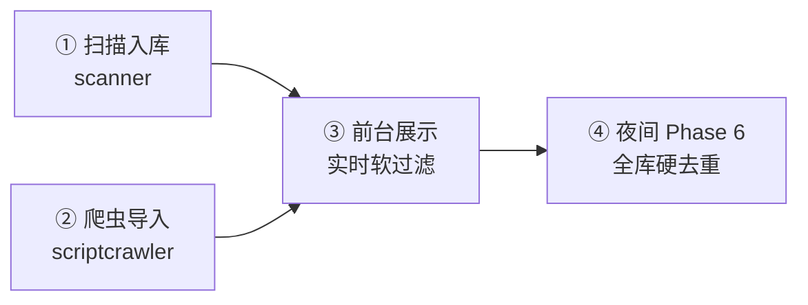
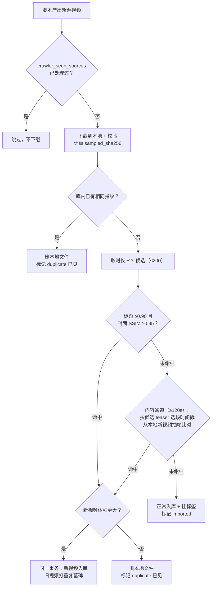
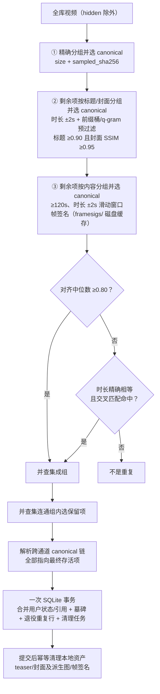

# 去重体系

去重不是某一个步骤，而是分布在视频生命周期四个时机的一套体系。设计思路：**有哈希或采样指纹时优先使用字节证据**（快、误判风险最低），**字节不同的转码/水印副本使用内容信号**（teaser 对齐帧）。原生哈希缺失或未命中时，扫描和实时软过滤还保留 `file_name + size_bytes` 弱兜底；它不是内容证明，存在同名同大小碰撞风险。

以下路径均相对 `backend/`：`internal/scanner`（扫描入库）、`internal/drives/scriptcrawler/neardupe.go`（爬虫导入）、`internal/dedupe`（硬去重 Planner）、`internal/catalog`（软过滤 `uniqueVideoWhereSQL`、墓碑与计划事务）、`cmd/server/video_maintenance.go` 和 `video_dedupe_plan.go`（夜间 Phase 6 适配/执行）、`internal/mediasim`（全部相似度算法与阈值常量）。

## 判定信号

| 信号 | 是什么 | 能抓住什么 | 抓不住什么 |
|------|--------|-----------|-----------|
| `(drive_id, file_id)` | 视频恒等 ID | 同盘同文件的重复扫描（upsert 同一行） | 一切副本 |
| `content_hash` | 网盘原生哈希（115 SHA1、pikpak GCID 等，格式因盘而异） | 同类盘内完全相同的文件 | 跨盘、转码副本 |
| `sampled_sha256` | `size + 采样字节` 的统一指纹，fingerprint worker 后台计算 | **跨盘**字节采样一致的文件 | 转码/水印副本 |
| `file_name + size_bytes` | 原生哈希缺失或未命中时的弱兜底 | 常见的同名同大小副本 | 改名副本；也可能碰撞不同内容 |
| 标题相似度 + 封面 SSIM | 归一化 Levenshtein（含核心段变体）+ 96×96 亮度 SSIM | 同源重发（标题几乎一样） | 改名重发、跨源转码 |
| teaser 帧签名 | teaser 按 1fps 抽 12 帧 96×96 灰度 | **跨源不同压制**（标题、封面全对不上也能抓） | 时长差 >2 秒的剪辑版 |

teaser 帧签名成立的原理：预览视频的**选段起点只由时长决定**（分档策略见 [README「异步生成」](../README.md#4-异步生成)，那里是唯一权威描述），所以时长几乎相等的两个视频，teaser 相同偏移处的帧通常来自同一源画面。压制、水印和裁切会降低分数，但不依赖标题或文件字节一致。

内容级两条判定规则（阈值常量统一在 `mediasim`，全库万对负样本实测标定，负样本几乎全部 <0.5）：

| 规则 | 条件 | 结论 |
|------|------|------|
| 对齐 | 对齐帧 SSIM 中位数 ≥0.80 | 重复，自动处理 |
| 交叉兜底 | 对齐未命中、**时长精确相等**时：双方各至少 8 个有效帧，双向逐帧最优匹配，单帧 ≥0.95、双向 ≥75% 帧强匹配 | 重复（teaser 某段回退到备选起点造成整段错位的场景） |

守卫：纯色/黑场帧（亮度标准差 <6）不参与统计——两张黑场的 SSIM≈1 是陷阱；有效比较帧 <6 不判；时长 <120 秒不启用内容级——短视频整秒时长碰撞太普遍（全库实测 10 秒档有近 400 个），时长相等不构成信号。

## 四个时机

**① 扫描入库（`internal/scanner`）**——同 `(drive_id, file_id)` 重复扫描只 upsert 同一行；`deleted_videos` 墓碑按 id / file_id / content_hash / 文件名+大小 拦截已删除视频回流；新条目若与库内视频 `content_hash` 相同（退化为 `file_name + size_bytes` 相同）则跳过入库。

**② 爬虫导入（`internal/drives/scriptcrawler`）**——层层拦截，重复视频在**上传网盘之前**就被挡下：

标记过 `crawler_seen_sources` 的源永远不会再下载，即使对应视频后来被夜间维护删掉——这保证"删重复"不会引起"再爬回来"的循环。

较大的新视频替换库内旧视频时，Catalog 在一个事务里完成新行写入、标签/反应/计数/分享合并、历史 canonical 引用重定向、旧行墓碑和 `crawler_seen_sources` 更新；事务提交后再清理旧视频的本地生成资产。任一步数据库操作失败都会回滚，旧视频仍留在库内。

**③ 前台展示（实时软过滤）**——`content_hash`、`size_bytes + sampled_sha256` 或弱兜底 `file_name + size_bytes` 相同的视频，前台列表和封面/预览生成队列只认最早入库的那条（`uniqueVideoWhereSQL`）。行还在库里，作用是在夜间硬去重跑到之前不给用户看重复、不给副本白白生成资产。

**④ 夜间 Phase 6（`internal/dedupe` + `cmd/server/video_maintenance.go`）**——全库硬去重。Planner 只读计算完整计划，三个通道串行，前一通道的逻辑删除项不进下一通道：

每个通道都从该通道形成的重复组内部选择 canonical，而不是从全库另找视频。精确通道按 **本地资产完整度 > 入库早**（组内文件本来一样大）；标题/封面与内容通道按 **体积大 > 资产完整度 > 入库早**——优先留原版画质。重复关系按传递闭包成组：A 命中 B、B 命中 C 时，A/B/C 属于同一个重复组。

Planner 跑完全部通道后会压缩 canonical 链。例如精确通道先得到 `B → A`，内容通道又得到 `A → C`，最终事务写成 `B → C`、`A → C`，不会留下指向中间删除项的引用。

提交前会校验删除项和最终 canonical 的视频修订；规划期间若任一相关行发生变化，整个事务回滚并基于最新数据重新规划（最多三次），不会拿过期计划继续删除。

合并语义（所有通道一致）：先把重复项的标签、访问反应、观看/点赞等计数、分享和历史任务引用合并到最终保留项，再打 `reason=duplicate` 墓碑并退役重复行。墓碑同时充当旧公开 ID 的别名，前台读取旧链接时会解析到当前存活项；后续再次合并会重定向到最终 canonical。**不删网盘源文件**；墓碑阻止后续扫描重新入库，恢复策略为 `none`，不能从后台恢复。事务同时登记 `duplicate_asset_cleanup_jobs`，提交后幂等清理本地 teaser、普通封面、Shorts 背景封面和帧签名缓存；进程中断或文件系统临时失败时由下一轮维护重试。

## 性能与工具

- 帧签名按 `(teaser size, mtime)` 缓存在 `previews/framesigs/`（约 110KB/视频），teaser 重新生成自动失效，视频删除同步清理；夜间维护和爬虫内容通道共用该缓存。全库冷跑约 7.5 分钟（一次性），之后每晚增量 ≈ 新视频数 × 0.2 秒抽帧 + 秒级比对。
- `go run ./cmd/dedupe-dryrun` 只读预演内容通道会删什么；它与夜间维护共用 `internal/dedupe` 生成 Plan。加 `-apply` 后一次提交该 Plan，并走同一套 Catalog 墓碑事务和提交后资产清理路径。
